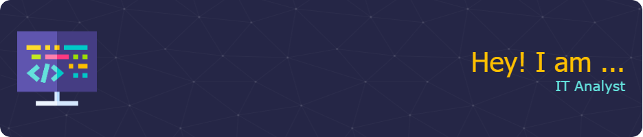

# Hi there, I'm Emerick! 👋

## 🧑‍💻 Listing
I'm an Microsoft 365 Adminstrator
 
- Former Deployment Specialist 
- Former Desktop Engineer
- Former Application Packager

## 🛠 Learning
 Markdown, HTML, CSS, Javascript, PowerShell.

## 🔗 Links

<!--
**egiberne/egiberne** is a ✨ _special_ ✨ repository because its `README.md` (this file) appears on your GitHub profile.

Here are some ideas to get you started:

- 🔭 I’m currently working on ...
- 🌱 I’m currently learning ...
- 👯 I’m looking to collaborate on ...
- 🤔 I’m looking for help with ...
- 💬 Ask me about ...
- 📫 How to reach me: ...
- 😄 Pronouns: ...
- ⚡ Fun fact: ...
-->
